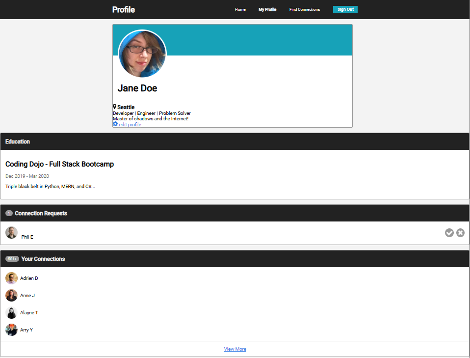

# Making Connections

#### Objectives

- Add **JavaScript** functionality to a previous assignment
- Use **JavaScript** to remove `elements` from the webpage

We've spent a lot of time working on some past projects and that hard work is something we can reuse. Let's return to the *Profile Page* assignment and add the types of **JavaScript** functionality we've previously learned onto it!

If we weren't happy with how ours turned out then feel free to use this already completed **HTML** and **CSS** code.

- [x] Clicking the edit profile button changes the user's name from Jane Doe to any other name

- [x] Clicking the check or x button in connection requests removes the user request from the list

- [x] Bonus: decrease the number of connection requests when a request is completed

- [x] Bonus: Increase the number of connections if a request was accepted.

Here are screenshots below of how mine turned out. 

